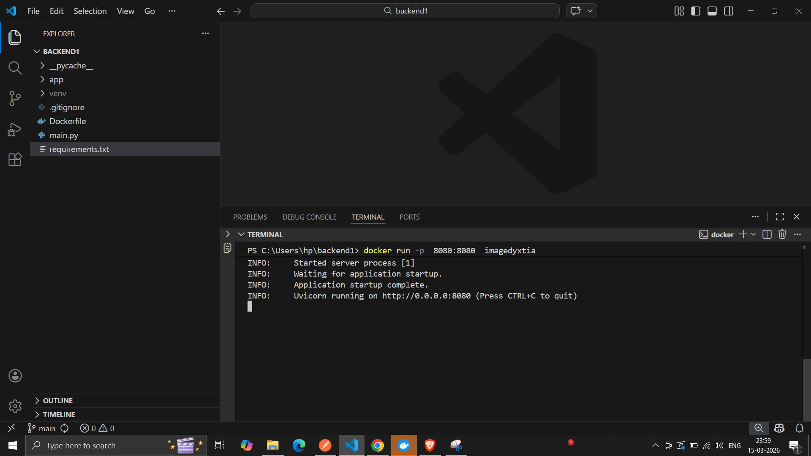
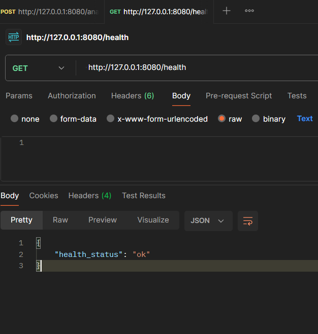

## Setup Instructions

Steps

1. Install Docker Desktop  
2. Install Postman  
3. Open Docker Desktop app  
4. Open VS Code or Cursor  

In terminal, paste the below commands in order:

`git clone https://github.com/ianuj4231/dyxtia_ianuj.git`

`cd dyxtia_ianuj`

`docker build -t imagedyxtia .`

`docker run -p 8080:8080 imagedyxtia`

Attached a sample below:

## Docker Run Demonstration



---

## API Testing Using Postman

### 1. Analyze File Endpoint

Hit using **POST** method:

`http://127.0.0.1:8080/analyze-file`

Request body should be of JSON type:

```json
{
  "business_name": "ABC Transport Ltd",
  "loan_amount_requested": 75000,
  "transactions": [
    {
      "date": "2024-01-02",
      "description": "Client Payment",
      "amount": 5200
    },
    {
      "date": "2024-01-03",
      "description": "Office Rent",
      "amount": -2000
    },
    {
      "date": "2024-01-05",
      "description": "Equipment Purchase",
      "amount": -750
    },
    {
      "date": "2024-01-07",
      "description": "Client Payment",
      "amount": 6100
    },
    {
      "date": "2024-01-10",
      "description": "Utilities",
      "amount": -400
    },
    {
      "date": "2024-01-15",
      "description": "NSF Fee",
      "amount": -45
    }
  ]
}
```

Screenshot of the output:


---

### 2. Health Endpoint

Hit using **GET**

`http://127.0.0.1:8080/health`

### Health Endpoint Output



---

## Section 2: Assumptions Made for Readiness

2.1 I used two variables:  
- `score` (integer)  
- `band` (string)

2.2 If the number of inflows in the input array exceeds the number of outflows, the score increments by **1**.

2.3 Along with the above rule, I added another rule:  
If **net cash flow is positive**, it indicates losses are minimal, the business is profitable, and inflow frequency is strong.  
So the **score increases by 2**, moving the business to the **strong category**.

2.4 If score ends up as **3 → Strong**

2.5 If score ends up as **1 → Structured**

2.6 If score remains **0 → Needs clarification**

---

## Section 3: Assumptions for Risk Flags

3.1 If one outflow transaction in the array makes up **more than half of the total outflow sum**, then flag:  
`Large single outflow detected`

3.2 If the number of inflows is **less than the number of outflows**, then flag:  
`Low inflow frequency`

3.3 If **net cash flow < 0**, then flag:  
`Negative net cash flow`

---

## Section 4: Demonstration Video

Video link:

https://www.dropbox.com/scl/fi/ok6q8sxhb7zg7n5thpdd9/c1.mp4?rlkey=flea0iqcg5f48jwsgz1jj7pd3&st=gk3sdy28&dl=0
