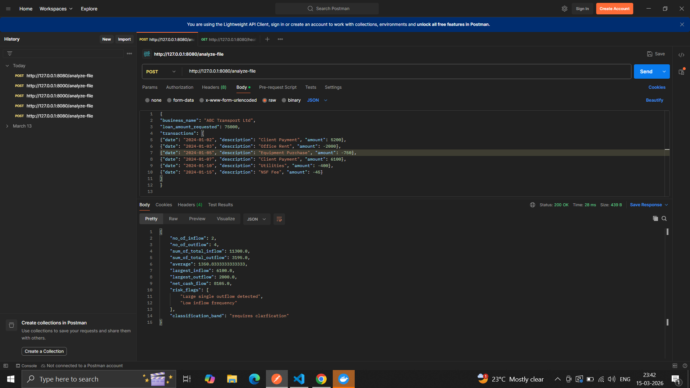

steps 
1. install  docker descktop
2. install postman
3. open docker desktop app

4 . open vs code or  cursor.

in terminal, paste below commands in order:


`git clone https://github.com/ianuj4231/dyxtia_ianuj.git`


`cd dyxtia_ianuj`


`docker build -t imagedyxtia .`


 `docker run -p  8080:8080  imagedyxtia`  

then in postman
1. hit using  "POST" method - `http://127.0.0.1:8080/analyze-file`
	


req body to be of json type:
		
```json
{
  "business_name": "ABC Transport Ltd",
  "loan_amount_requested": 75000,
  "transactions": [
    {
      "date": "2024-01-02",
      "description": "Client Payment",
      "amount": 5200
    },
    {
      "date": "2024-01-03",
      "description": "Office Rent",
      "amount": -2000
    },
    {
      "date": "2024-01-05",
      "description": "Equipment Purchase",
      "amount": -750
    },
    {
      "date": "2024-01-07",
      "description": "Client Payment",
      "amount": 6100
    },
    {
      "date": "2024-01-10",
      "description": "Utilities",
      "amount": -400
    },
    {
      "date": "2024-01-15",
      "description": "NSF Fee",
      "amount": -45
    }
  ]
}
```

and screenshot of the output:




2.  hit "GET"  `http://127.0.0.1:8080/health`

////

section 2:
assumptions made for readiness:
2.1) i used 2 variables- one score vatriable (int) and another band (string) variable...
2.2)  if no of inflows in input array only  exceeds no of outflows..then score will increment by 1... 
2.3) alongf with above criteria , added new rule, if net cash flow is positive, his losses are minimal, he is surely in profit side, and inflow frequency is also high...so hence...score will increase by 2 .... move him to strong category.
2.4) if score ends up as 3, he is strong
2.5) if score ends up as 1, he is structured.
2.6) if score remainined 0, he will need clarification.

section  3:
assumptions for risk flags..
3.1) if one outflow in the array makes up for more than half of total_outflow_sum..., then it will be   "Large single outflow detected"  ..
3.2)     if no_of_inflow in the input array is   less than  no_of_outflow, then it is  "Low inflow frequency" 
3.3) if net cash flow < 0, then ... "Negative net cash flow"


section  4:

4.1 ) video link..

https://www.dropbox.com/scl/fi/ok6q8sxhb7zg7n5thpdd9/c1.mp4?rlkey=flea0iqcg5f48jwsgz1jj7pd3&st=gk3sdy28&dl=0


5) working screenshots:
   
